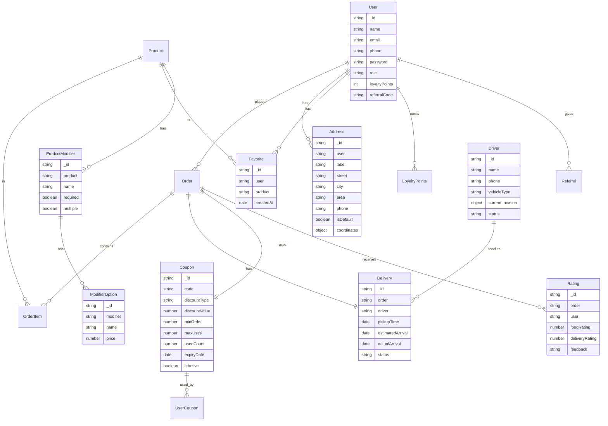

# Qween Burger - Feature Analysis & Recommendations

## Executive Summary

This document analyzes the current Qween Burger application and compares it with popular food delivery platforms like Uber Eats, DoorDash, Zomato, and local Ethiopian platforms to identify missing features and improvement opportunities.

---

## Current Features Implemented

### ✅ Core Features

| Feature                 | Status      | Notes                    |
| ----------------------- | ----------- | ------------------------ |
| User Registration/Login | ✅ Complete | JWT-based authentication |
| Password Reset          | ✅ Complete | Email-based reset        |
| Product Catalog         | ✅ Complete | With categories, images  |
| Product Search          | ✅ Complete | Basic text search        |
| Shopping Cart           | ✅ Complete | Context-based state      |
| Checkout                | ✅ Complete | Multi-step form          |
| Order Management        | ✅ Complete | Create, view, cancel     |
| Payment Integration     | ✅ Complete | Chapa payment gateway    |
| Admin Dashboard         | ✅ Complete | Products, orders, users  |
| Real-time Updates       | ✅ Complete | Socket.io integration    |
| Email Notifications     | ✅ Complete | Order confirmations      |
| Product Reviews         | ✅ Complete | Ratings and comments     |
| Responsive Design       | ✅ Complete | Mobile-friendly          |
| Contact Page            | ✅ Complete | With OpenStreetMap       |

---

## Missing Features - High Priority

### 🔴 1. Delivery Tracking System

**What it is:** Real-time GPS tracking of delivery drivers
**Why important:** Industry standard for food delivery apps
**Platforms using it:** Uber Eats, DoorDash, Zomato, Glovo

**Implementation needed:**

- Driver/Delivery Person model and management
- GPS location tracking integration
- Live map showing delivery progress
- ETA updates
- Customer notifications at each stage

```
New Models Needed:
- Driver (name, phone, vehicle, location, status)
- Delivery (order, driver, pickupTime, estimatedArrival, actualArrival)
```

### 🔴 2. Push Notifications

**What it is:** Mobile push notifications for order updates
**Why important:** User engagement and order tracking
**Platforms using it:** All major platforms

**Implementation needed:**

- Firebase Cloud Messaging (FCM) integration
- Web Push API for browsers
- Notification preferences in user settings
- Push notification templates

### 🔴 3. Order Scheduling

**What it is:** Allow customers to schedule orders for later
**Why important:** Customer convenience, better planning
**Platforms using it:** Uber Eats, DoorDash

**Implementation needed:**

- Scheduled delivery time field in Order model
- Calendar/time picker in checkout
- Admin scheduling dashboard
- Automated order processing at scheduled time

### 🔴 4. Promo Codes & Discounts

**What it is:** Discount codes, promotional offers
**Why important:** Marketing, customer retention
**Platforms using it:** All major platforms

**Implementation needed:**

```
New Models Needed:
- Coupon (code, discountType, discountValue, minOrder, maxUses, expiryDate, isActive)
- UserCoupon (user, coupon, usedAt)

Features:
- Apply coupon at checkout
- Percentage or fixed amount discounts
- Free delivery coupons
- First-order discounts
- Admin coupon management
```

### 🔴 5. Multiple Delivery Addresses

**What it is:** Save multiple addresses for quick checkout
**Why important:** User convenience
**Platforms using it:** All major platforms

**Implementation needed:**

```
Update User Model:
- addresses: [{ label, street, city, area, phone, isDefault, coordinates }]

Features:
- Address management in profile
- Quick address selection at checkout
- Address label (Home, Work, Other)
- Set default address
```

---

## Missing Features - Medium Priority

### 🟡 6. Favorites/Wishlist

**What it is:** Save favorite products for quick access
**Why important:** User engagement, faster ordering
**Platforms using it:** All major platforms

**Implementation needed:**

- Favorites array in User model
- Heart icon on product cards
- Favorites page/section
- Quick add to cart from favorites

### 🟡 7. Order Reordering

**What it is:** One-click reorder from past orders
**Why important:** Convenience for repeat customers
**Platforms using it:** All major platforms

**Implementation needed:**

- Reorder button on order history
- Add all items to cart functionality
- Handle unavailable items gracefully

### 🟡 8. Product Customization/Modifiers

**What it is:** Customize orders (extra cheese, no onions, etc.)
**Why important:** Customer preferences, upselling
**Platforms using it:** All major platforms

**Implementation needed:**

```
New Models:
- ProductModifier (name, options, required, multiple)
- ModifierOption (name, price)

Example:
- Size: Small, Medium, Large (+$2)
- Extras: Cheese (+$1), Bacon (+$2)
- Remove: Onions, Pickles, Sauce
```

### 🟡 9. Restaurant/Store Hours

**What it is:** Operating hours, closed days
**Why important:** Set customer expectations
**Platforms using it:** All major platforms

**Implementation needed:**

- Operating hours in settings
- Show open/closed status
- Pre-order for when open
- Holiday hours management

### 🟡 10. Order Rating & Feedback

**What it is:** Rate delivery experience, food quality
**Why important:** Quality control, feedback loop
**Platforms using it:** All major platforms

**Implementation needed:**

- Order rating (1-5 stars)
- Delivery rating
- Food quality rating
- Feedback text
- Admin feedback dashboard

### 🟡 11. Loyalty Points System

**What it is:** Earn points on orders, redeem for discounts
**Why important:** Customer retention
**Platforms using it:** Starbucks, many local platforms

**Implementation needed:**

- Points per order calculation
- Points balance in user profile
- Redeem points at checkout
- Points history
- Admin points management

### 🟡 12. Social Login

**What it is:** Login with Google, Facebook
**Why important:** Easier registration, higher conversion
**Platforms using it:** Most platforms

**Implementation needed:**

- Google OAuth integration
- Facebook OAuth integration
- Link social accounts to existing accounts

---

## Missing Features - Lower Priority

### 🟢 13. Live Chat Support

**What it is:** In-app chat with customer support
**Why important:** Customer service
**Platforms using it:** Many platforms

### 🟢 14. Referral System

**What it is:** Invite friends, earn credits
**Why important:** User acquisition
**Platforms using it:** Uber Eats, DoorDash

**Implementation needed:**

- Unique referral codes
- Credit for referrer and referee
- Referral tracking dashboard

### 🟢 15. Multi-language Support

**What it is:** Support for multiple languages
**Why important:** Accessibility (already partially implemented with Amharic)

**Current state:** Basic Amharic translations exist
**Improvements needed:**

- Complete translations
- Language persistence
- More languages (Tigrinya, Oromo)

### 🟢 16. Dark Mode

**What it is:** Dark theme option
**Why important:** User preference, accessibility
**Platforms using it:** Many modern apps

### 🟢 17. Order Notes per Item

**What it is:** Special instructions for individual items
**Why important:** Customization
**Platforms using it:** All major platforms

### 🟢 18. Estimated Delivery Time Display

**What it is:** Show estimated time before ordering
**Why important:** Set expectations
**Platforms using it:** All major platforms

### 🟢 19. Minimum Order Amount

**What it is:** Minimum order for delivery
**Why important:** Business logic
**Platforms using it:** Many platforms

### 🟢 20. Delivery Fee by Distance

**What it is:** Dynamic delivery fees
**Why important:** Accurate pricing
**Platforms using it:** All major platforms

---

## Technical Improvements Needed

### Backend

1. **Rate Limiting** - Prevent API abuse
2. **Caching** - Redis for products, sessions
3. **Queue System** - Bull/Redis for email jobs
4. **API Versioning** - /api/v1/ prefix
5. **Logging** - Winston or Pino for structured logs
6. **Health Checks** - /health endpoint
7. **Database Backups** - Automated backup strategy
8. **Unit Tests** - Jest tests for controllers
9. **Integration Tests** - Supertest for API tests

### Frontend

1. **Error Boundaries** - Graceful error handling
2. **Lazy Loading** - Code splitting for pages
3. **Service Worker** - Offline support
4. **PWA** - Installable app
5. **Image Optimization** - WebP, lazy loading
6. **Analytics** - Google Analytics or Mixpanel
7. **Error Tracking** - Sentry integration

### Security

1. **CORS Configuration** - Stricter settings
2. **Helmet.js** - Security headers
3. **Input Sanitization** - XSS prevention
4. **Rate Limiting** - Brute force protection
5. **2FA** - Two-factor authentication option
6. **Session Management** - Device management

---

## Recommended Implementation Order

### Phase 1 - Essential (Week 1-2)

1. Multiple Delivery Addresses
2. Promo Codes & Discounts
3. Order Reordering
4. Favorites/Wishlist

### Phase 2 - Growth (Week 3-4)

1. Push Notifications
2. Order Scheduling
3. Product Customization/Modifiers
4. Order Rating & Feedback

### Phase 3 - Scale (Week 5-6)

1. Delivery Tracking System
2. Loyalty Points System
3. Social Login
4. Referral System

### Phase 4 - Polish (Week 7-8)

1. Live Chat Support
2. Dark Mode
3. PWA Features
4. Analytics & Error Tracking

---

## Database Schema Additions



---

## Competitive Analysis Summary

| Feature               | Qween Burger | Uber Eats | DoorDash | Zomato | Glovo |
| --------------------- | ------------ | --------- | -------- | ------ | ----- |
| Product Catalog       | ✅           | ✅        | ✅       | ✅     | ✅    |
| Cart & Checkout       | ✅           | ✅        | ✅       | ✅     | ✅    |
| Payment Integration   | ✅           | ✅        | ✅       | ✅     | ✅    |
| Order Tracking        | ❌           | ✅        | ✅       | ✅     | ✅    |
| Delivery Tracking     | ❌           | ✅        | ✅       | ✅     | ✅    |
| Push Notifications    | ❌           | ✅        | ✅       | ✅     | ✅    |
| Promo Codes           | ❌           | ✅        | ✅       | ✅     | ✅    |
| Multiple Addresses    | ❌           | ✅        | ✅       | ✅     | ✅    |
| Favorites             | ❌           | ✅        | ✅       | ✅     | ✅    |
| Order Scheduling      | ❌           | ✅        | ✅       | ❌     | ✅    |
| Product Customization | ❌           | ✅        | ✅       | ✅     | ✅    |
| Loyalty Points        | ❌           | ❌        | ✅       | ✅     | ❌    |
| Social Login          | ❌           | ✅        | ✅       | ✅     | ✅    |
| Live Chat             | ❌           | ✅        | ✅       | ✅     | ✅    |
| Referral System       | ❌           | ✅        | ✅       | ❌     | ✅    |
| Dark Mode             | ❌           | ✅        | ✅       | ✅     | ❌    |
| PWA                   | ❌           | ✅        | ✅       | ✅     | ✅    |

---

## Conclusion

The Qween Burger application has a solid foundation with core e-commerce functionality. The main gaps compared to popular platforms are:

1. **Delivery Management** - No driver tracking or real-time delivery updates
2. **Customer Engagement** - Missing loyalty, referrals, favorites
3. **Order Flexibility** - No scheduling, customization, or promo codes
4. **User Convenience** - No multiple addresses, reordering

Implementing the Phase 1 features would bring the app to parity with basic food delivery platforms, while Phase 2-3 features would make it competitive with major players in the market.

---

_Generated: February 2026_
